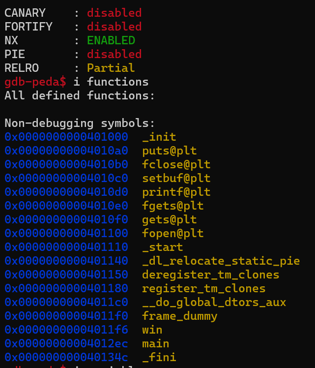
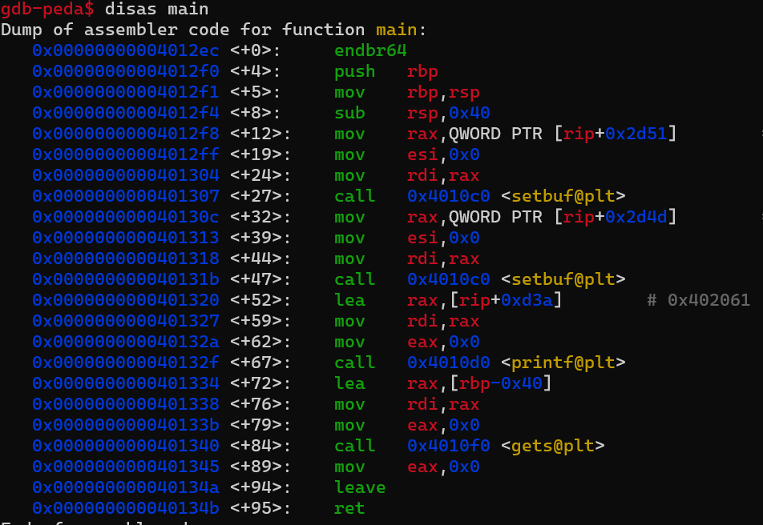
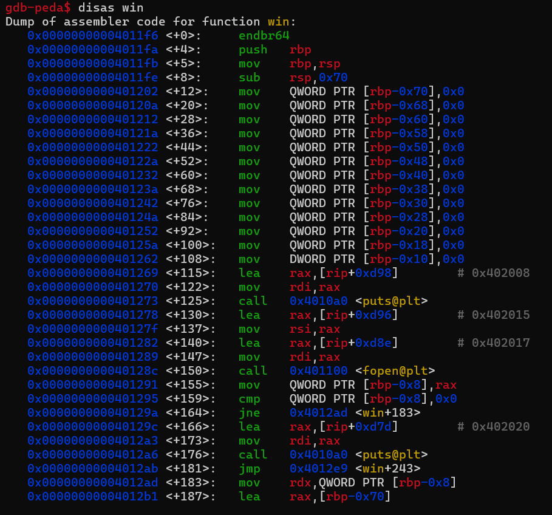

# dejavu-squirelCTF-2025 (Under-Contruction)

 

## 1. Information Gathering (How does it work?)
 

### 1.1 Security and functions address analysis

 

As you can see, this binary has a protection by NX (Not Executable) and the function address is:
<ol>
<li>
  <strong>main: <italic>0x004012ec</italic></strong>
</li>
<li>
  <strong>win: <italic>0x004011f6</italic></strong>
</li>
</ol>
 

### 1.2 logic of functions analiysis

#### Main function:

#### Win function:

 
The main function calls a <gets> that receives input from user and win function calls a <fopen> and <printf> that show the flag
